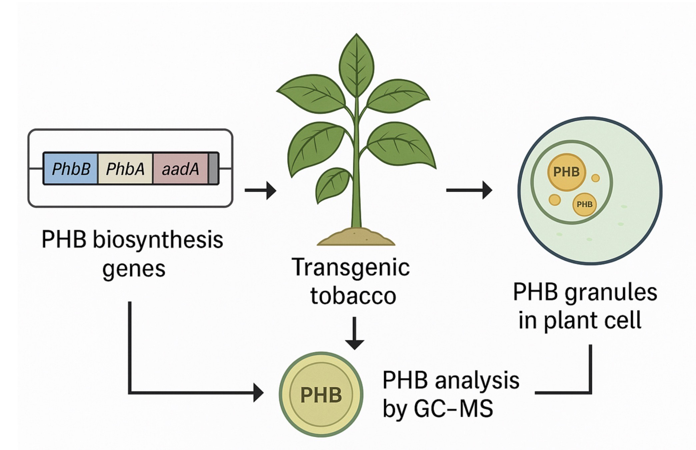

## Procedure

A refined genetic construct for plastid transformation of tobacco (Nicotiana tabacum) aimed at producing the renewable, biodegradable plastic polyhydroxybutyrate (PHB) was developed utilising an operon extension technique. Bacterial genes that encode the enzymes of the PHB pathway were chosen for this build because to their resemblance to the codon usage and GC content of the tobacco plastome. Regulatory elements exhibiting minimal homology to the host plastome, yet recognised for their capacity to produce elevated quantities of plastidial recombinant proteins, were employed to augment transgene expression. A partial transcriptional unit, comprising genes of the PHB pathway and a selectable marker gene for spectinomycin resistance, was bordered at the 5′ end by the host plant's psbA coding sequence and at the 3′ end by the host plant's 3′ psbA untranslated region. This design facilitated the incorporation of transgenes into the plastome as an extension of the psbA operon, eliminating the need for an additional promoter to regulate transgene expression. The optimised construct was transformed into tobacco, and subsequent selection of transgenic plants using spectinomycin resulted in T0 plants that produced up to 18.8% dry weight PHB in leaf tissue samples. These plants were productive and yielded viable seeds. T1 plants were separated, yielding up to 17.3% dry weight PHB in leaf tissue samples and 8.8% dry weight PHB in the total biomass of the plant.
A step-by-step procedure is given for the production of PHBs in tobacco plant by Karen et al, 2011

#### 1. Gene and Vector Preparation
- The bacterial genes phaA, phaB, and phaC were selected and codon-optimized for tobacco plastids.
- These genes were arranged in order: phaC–phaA–phaB with short spacers.
- A T7g10 5′ UTR was placed before the gene phaC to increase protein translation.
- The entire gene cluster was incorporated just after the psbA gene in the chloroplast genome.
- A selectable marker aadA coding for spectinomycin resistance was included.
- The final construct (pCAB) was verified by DNA sequencing.

#### 2. Plant Material Preparation
- Seeds of Nicotiana tabacum cv. Petite Havana SR1 were sterilized and germinated on MS medium with 2% sucrose.
- Seedlings were grown under 16-hour light / 8-hour dark cycles at 23°C.

#### 3. Chloroplast Transformation
- Leaf explants were cut and placed on MS plates.
- DNA-coated 0.6 µm gold particles are bombarded onto leaves using a PDS-1000/He biolistic device.
- Bombarded leaves were transferred to selection medium containing 500 mg/L spectinomycin.

#### 4. Selection and Regeneration
- Resistant shoots were regenerated and transferred to fresh selective medium.
- The regenerated plants were rooted and grown under sterile conditions.
- Multiple regeneration cycles (R1 → R2 → R3) were performed until homoplasmic lines are obtained.

#### 5. Molecular Confirmation
- PCR was used to confirm the correct insertion of genes at the psbA site.
- Southern blot analysis was performed to ensure single-copy insertion.
- Additional PCR was done to confirm that no unwanted vector backbone is integrated.

#### 6. Plant Growth and Maintenance
- Confirmed transplastomic plants were transferred to soil.
- Plants were grown in a greenhouse under 16-hour light (≥150 µmol·m⁻²·s⁻¹) / 8-hour dark cycles at 23°C.
- Transgenic plants were observed to have slightly pale leaves and slower growth but remain fertile.

#### 7. PHB Quantification
- Leaves were dried and ground (30–150 mg of tissue used per sample).
- PHB was extracted and converted to butyl esters for analysis.
- GC-MS was used to measure PHB content as a percentage of dry weight.
- PHB was found mainly in mature leaves, typically 10–18.8% DW.

#### 8. Polymer Analysis (Optional)
- PHB was extracted from dried tissue using chloroform at 61°C for 4 hours.
- The extract was filtered and analyzed by GPC.
- Average molecular weight was around 4.7 × 10⁵ with a PDI of about 2.2.

#### 9. Microscopic Observation (Optional)
- Leaf sections were fixed in paraformaldehyde and glutaraldehyde.
- Samples were post-fixed with osmium tetroxide, dehydrated, and embedded in resin.
- Thin sections (60 nm) were stained and viewed under a transmission electron microscope (TEM).
- PHB granules were observed inside chloroplasts.

#### 10. Stability Check in Next Generation
- Seeds from transgenic plants were germinated on MS medium with spectinomycin.
- The presence of green seedlings indicated stable plastid inheritance.
- Lines showing almost all green seedlings are considered fully homoplasmic.

