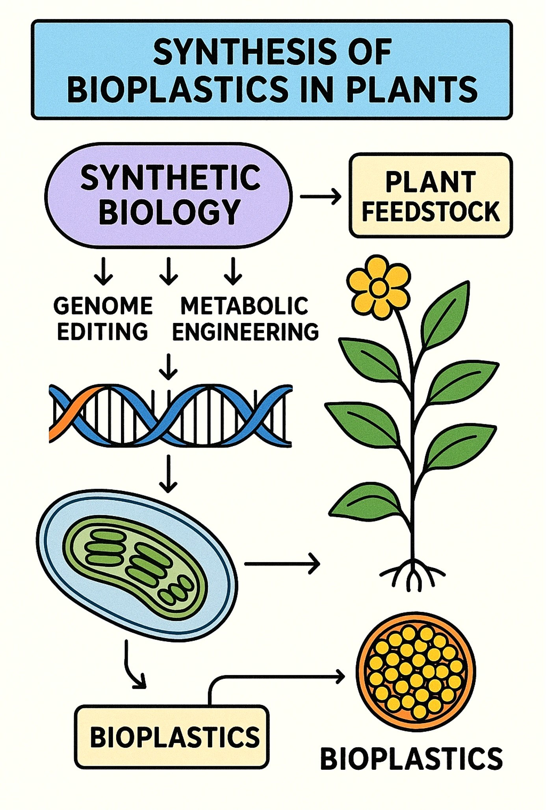

## Theory

Synthetic biology is an interdisciplinary domain that employs engineering ideas to biology to design, create, and reprogram biological systems for beneficial applications.  Synthetic biology, in contrast to conventional genetic engineering that usually alters a limited number of genes, emphasises standardisation, modularity, and abstraction, regarding DNA sequences and genetic components as programmable entities akin to electronic circuits.  The process employs an iterative Design–Build–Test–Learn (DBTL) cycle, facilitating the development of gene circuits, metabolic pathways, minimum genomes, and fully synthetic creatures.  Methods encompass metabolic engineering for the synthesis of fuels, bioplastics, or pharmaceuticals; gene circuit engineering for the construction of biosensors or logic gates; genome editing and synthesis utilising CRISPR and synthetic DNA; and orthogonal systems that operate independently of native cellular mechanisms.  Applications encompass healthcare (engineered microorganisms for pharmaceutical production or oncological treatment), agriculture (stress-resistant crops and plant-derived bioproducts), energy and environment (biofuels, bioremediation, and carbon sequestration), and industry (enzymes, biomaterials, fragrances, and DNA-based data storage).  The domain elicits apprehensions surrounding biosafety, biosecurity, and ethics, particularly with the hazards of inadvertent release, possible exploitation, and the overarching consequences of "creating life."  Synthetic biology is emerging as a transformative discipline due to rapid advancements in genome design, AI-driven modelling, and xenobiology (organisms with synthetic nucleotides beyond A, T, G, and C). It perceives life as programmable and holds significant potential for medicine, sustainability, and biotechnology, necessitating meticulous ethical and regulatory oversight.

An example for the use of synthetic biology in plants is that of the production of bioplastics. This assumes importance in view of the need to make available nature friendly solutions as well as the long term sustenance of nature. A general description of how bioplastics are developed is given below.

#### Synthetic biology in plants for the production of bioplastics: 
Synthetic biology in plants for bioplastic manufacturing is an innovative approach that use engineering concepts to reconfigure plant metabolism, thereby producing biodegradable and sustainable alternatives to petroleum-derived polymers. Plants serve as optimal hosts due to their renewability, scalability, and inherent ability to sequester carbon via photosynthesis. The primary emphasis has been on developing engineering paths for polymers, including polyhydroxyalkanoates (PHAs) and polylactic acid (PLA), alongside the enhancement of native polymers such as starch and cellulose for plastic manufacturing. Bacterial genes (phaA, phaB, phaC) have been incorporated into Arabidopsis, Camelina, and tobacco to synthesise PHB, a form of PHA, whereas lactic acid biosynthetic pathways have been modified in plants for PLA production. Synthetic biology techniques, including promoter engineering, pathway compartmentalisation in plastids or seeds, CRISPR/Cas genome editing, and synthetic organelle design, are utilised to enhance yields and minimise metabolic strain on host plants. Notwithstanding achievements, obstacles persist, such as low polymer production, growth penalties, and complications in extraction and processing. Recent advancements, such as seed-specific polymer accumulation in Camelina, plastid genome editing, and algal systems for accelerated production, are enhancing feasibility. In the future, the integration of synthetic biology, metabolic modelling, and AI-driven pathway optimisation may facilitate large-scale manufacturing of plant-based bioplastics, establishing plants as sustainable "green factories" within the circular bioeconomy.

This diagram represents a basic concept of synthetic biology for the production of bioplastic in plants.

#### Bioplastics Produced in Plants
#### 1.	Polyhydroxyalkanoates (PHAs):
- A family of biodegradable polyesters naturally produced by bacteria.
- Synthetic biology allows integration of bacterial PHA biosynthetic pathways into plants.
- Example: Expression of phaA, phaB, and phaC genes from bacteria in Arabidopsis and Camelina seeds to accumulate PHB (polyhydroxybutyrate).
#### 2.	Polylactic Acid (PLA):
- PLA is produced from lactic acid monomers, which can be derived from glucose.
- Engineering plants to produce lactic acid via lactate dehydrogenase, followed by polymerization into PLA.
#### 3.	Starch- and Cellulose-based Plastics:
- Enhancing starch content in potato, maize, or cassava through metabolic engineering.
- Starch and cellulose can then be chemically or enzymatically converted into thermoplastics.
#### 4.	Isoprenoid-derived Polymers:
- Engineering of isoprenoid pathways for rubber-like polymers (polyisoprene).
- Example: Genetic engineering of Hevea brasiliensis rubber biosynthesis genes in model plants.

#### Examples of engineering strategies 
#### 1. Expression of bacterial phaABC in chloroplasts/plastids and seeds.
This seminal and impactful study revealed that the expression of the three-gene PHB pathway in plastids or chloroplasts can yield significant polymer production. Transplastomic expression is appealing due to plastids' capacity for elevated transgenic expression, maternal confinement, and proximity to acetyl-CoA pools. Significantly, optimised gene expression and plastid targeting in tobacco resulted in elevated amounts of PHB via plastid-encoded PHB pathways, without compromising fertility [1].

#### 2. Seed-specific accumulation (Camelina / oilseed crops).
Polyhydroxybutyrate (PHB) is a biodegradable biopolymer water-insoluble, biocompatible, with applications in health, packaging, and agriculture, though its fragility can be a limitation that is addressed by creating blends and composites with other polymers. Seed-targeting techniques employ seed-specific promoters and plastid or cytosolic targeting signals to facilitate the accumulation of PHB in seed tissues (oil bodies or plastids), hence reducing penalties associated with vegetative development and allowing for the collection of seed biomass. Research on Camelina sativa and other oilseeds demonstrates significant PHB accumulation in seeds when utilising constructs that incorporate plastid targeting sequences and optimised seed promoters. Documented seed PHB concentrations fluctuate according on build design and targeting [2].

#### 3. Subcellular compartmentalization & metabolic channeling. 
Due to the compartmentalisation of PHB precursors (acetyl-CoA) and cofactors within cells, researchers have directed PHB enzymes to plastids, peroxisomes, or oil bodies to enhance precursor accessibility and minimise disruption of cytosolic metabolism. Plastid targeting frequently results in greater polymer accumulation compared to cytosolic expression; nevertheless, improper targeting may lead to growth deficiencies [3].

#### 4. Vector, operon and expression engineering.
Synthetic operons, codon optimisation, N-terminal targeting sequences, seed-specific promoters, and multigene vectors, including plastid transformation vectors, have been employed to equilibrate enzyme stoichiometry and enhance yields, such as synthetic operons producing phaCAB under plastid regulation.
 [4].

#### Major technical bottlenecks:
#### Precursor availability and competing pathways. 
Acetyl-CoA and reducing equivalents are needed for PHB; diverting them reduces biomass or yield. Engineering to increase plastid acetyl-CoA pools or to reroute carbon flux is an active area [5]. 

#### Toxicity / developmental effects. 
Ectopic polymer accumulation, especially in cytosol, can disrupt organelle function and development. Precise compartment targeting and controlled promoters mitigate this [3]. 

#### Extraction and downstream processing. 
Recovering high-molecular-weight polymer from plant matrices (cell walls, storage oils) is more complex than bacterial fermentation; cost-effective separation methods remain necessary [6]. 

#### Scale and economics. 
Even with successful lab-scale demonstrations, the per-hectare polymer yield must compete with microbial fermentation and petrochemical plastics; techno-economic analyses are required on a case-by-case basis [7].  

The creation of plant-based bioplastics is scientifically viable and has been validated at both the proof-of-concept and intermediate stages, particularly using plastid and seed methodologies. Translating laboratory-scale demonstrations to economically viable large-scale agriculture necessitates significantly increased per-hectare yields, enhanced extraction methodologies, reduced agronomic drawbacks, and comprehensive techno-economic and life-cycle assessments compared to microbial and petrochemical pathways. The integration of systems metabolic engineering, organelle targeting, and computer optimisation is the most promising immediate advancement.

